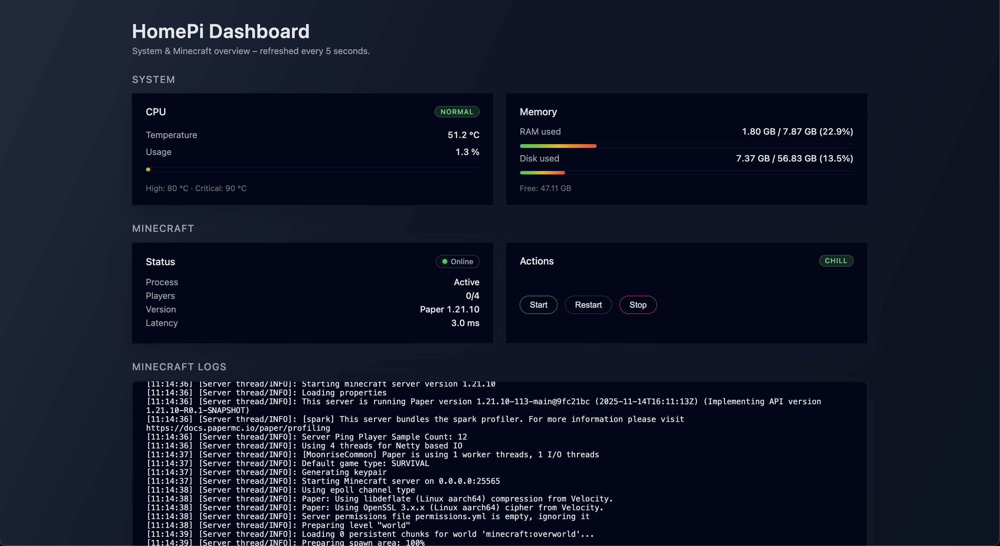

# 🏠 HomePi Dashboard

A lightweight monitoring and control dashboard for my Raspberry Pi 5 and Minecraft server.
Built with FastAPI, vanilla JavaScript and systemd.

## ⭐️ Features

### 🔧 *System Monitoring*

- CPU temperature & usage
- RAM and disk usage
- Auto-refresh every 5 seconds

### 🟩 *Minecraft Management*

- Start / Stop / Restart the server (via systemd)
- Live server status (online/offline, latency, players, version)
- Activity snapshot (CPU/RAM/mood)
- Log tailing (polling-based with auto-scroll)

## Screenshot

